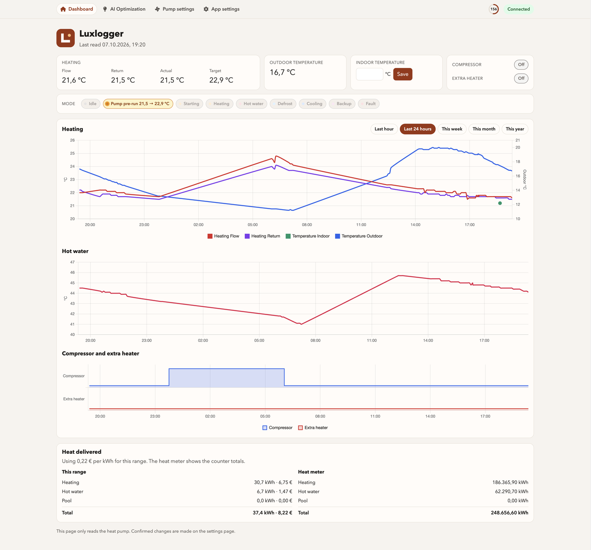
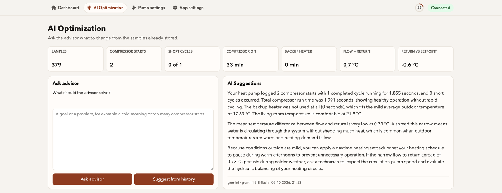
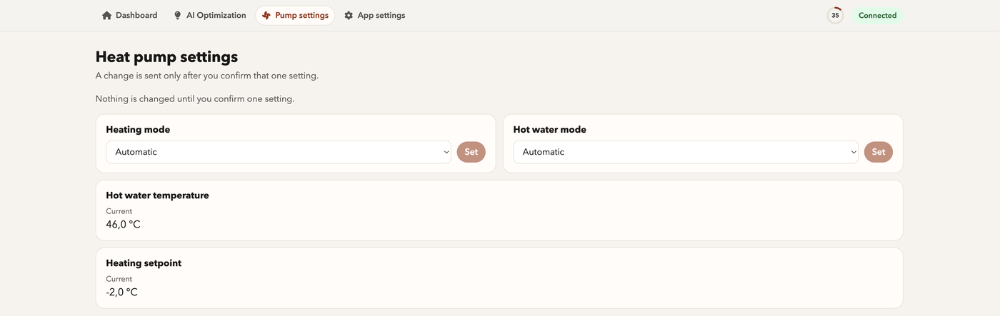

# Luxlogger

A local heat-pump logger for **Luxtronik 2.0** controllers, and for every heat pump that uses one. Brands that ship this controller include Alpha Innotec, Novelan, and others built on the same board.

Luxlogger sits on your home network, reads the controller over TCP, and stores the samples in SQLite. Open it in any browser on that network to see the latest state, charts, and history. There is no login. The app is meant to stay on the LAN and should not be published to the internet.



## Development & License

It was built in [Cursor](https://cursor.com) with Grok 4.7. Luxlogger is released under the [MIT License](LICENSE). Anyone may use, change, and share it, including for commercial use, as long as the copyright notice and license stay with the copy.

## What it does

On a schedule (every 60 seconds by default) the app connects to the controller, reads temperatures and operating state, and writes a row to `data/luxtronik_data.db`. The web UI is a thin view over that database, so a phone or laptop only needs to reach the machine running Luxlogger.

The browser has four pages:

| Page | What you see |
| --- | --- |
| Dashboard | Flow, return, outdoor, and hot-water temperatures, compressor and backup-heater state, operating mode, and a chart of stored samples. You can also type a room temperature. |
| AI Optimization | Diagnostics from the stored window, then a written suggestion from OpenAI, Gemini, or Anthropic. Optional, and only used when you ask. |
| Pump settings | A first look at controller values. A write is sent only after you confirm that one setting. |
| App settings | Controller address and port, equipment names, electricity price, the advisor model, and the two prompts the advisor follows. |





Polling can be paused from App settings. Set `DEMO_MODE=true` to fill the database with synthetic samples when no controller is on the network. The pages still work.

### Prompts

The advisor follows two prompts, both edited on **App settings** and stored in the database, not in `.env`:

- **Advice prompt** — how the written suggestion should read. The built-in text asks for plain sentences about short cycling, runtime, the backup heater, and temperatures, and it tells the model not to invent measurements.
- **Settings prompt** — how suggested controller changes should be chosen. The built-in text allows only heating mode, hot water mode, hot water temperature, and the heating setpoint, and it prefers no change.

Either box can be rewritten. A prompt cannot be empty and must stay within 8,000 characters. **Restore default prompts** puts the built-in text back into the form. Save afterwards, or the previous text stays in use. Changing a prompt does not require a restart.

### Controller port

The controller speaks its own TCP protocol, separate from its web login.

| Firmware | Port |
| --- | --- |
| Older than 1.76 | **8888** |
| 1.76 and later | **8889** |

Set `LUXTRONIK_PORT` to the port your unit actually listens on.

### What is stored

`data/luxtronik_data.db` holds:

- `telemetry_samples` — flow, return, outdoor, and hot-water temperatures, setpoints, flow rate, compressor speed and runtime, backup-heater stage, operating mode, and heat-meter totals
- `indoor_temperatures` — room readings you type in
- `advisor_reports` — the diagnostics JSON and the suggestion text
- `setting_changes` — values you confirmed on the pump settings page
- `app_preferences` — address, equipment, price, and advisor options saved from the UI

`DATABASE_URL` is a SQLAlchemy URL. A `postgresql://` URL is enough to move off SQLite later. The JSON routes under `/api` are what the pages call.

## Requirements

- Python 3.10 or newer (3.12 is what the Docker image and the examples use)
- The heat pump reachable on your LAN, or demo mode
- An API key only if you use the advisor

## Run locally

```bash
python3.12 -m venv .venv
source .venv/bin/activate
pip install -r requirements.txt
cp .env.example .env
```

Edit `.env` before the first start. `.env.example` is only a template: copy it, then replace the sample values with yours. `.env` is gitignored. Do not commit it, and do not put a real controller address, a controller password, or an API key in the repository.

| Variable | What to set |
| --- | --- |
| `LUXTRONIK_HOST` | Address of the controller on your LAN. The sample in `.env.example` is a placeholder. |
| `LUXTRONIK_PORT` | `8888` before firmware 1.76, `8889` from 1.76 on. |
| `LUXTRONIK_USER_PASSWORD` | Controller web login, if you have one. The TCP data port does not use it. Leave it empty for logging. |
| `LUXTRONIK_EXPERT_PASSWORD` | Expert web login. Same as above: unused by the data port, so leave it empty unless you need it. |
| `POLL_INTERVAL_SECONDS` | How often the pump is read and the pages reload. Default `60`. Minimum `5`. |
| `DATABASE_URL` | Where samples are stored. Leave `sqlite:///data/luxtronik_data.db` unless you move to PostgreSQL. |
| `DEMO_MODE` | `false` when a controller is reachable. `true` writes synthetic samples instead. |
| `AI_PROVIDER` | `openai`, `gemini`, or `anthropic`. Used only when you ask the advisor. |
| `AI_MODEL` | A model id for that provider, or empty to use the provider default. |
| `ADVICE_WINDOW_HOURS` | How many hours of samples the advisor reads. Default `24`. From `1` to `168`. |
| `SHORT_CYCLE_SECONDS` | A compressor run shorter than this counts as a short cycle. Default `600`. |
| `OPENAI_API_KEY` | Key for OpenAI. Leave empty if you do not use that provider. |
| `GEMINI_API_KEY` | Key for Gemini. Leave empty if you do not use that provider. |
| `ANTHROPIC_API_KEY` | Key for Anthropic. Leave empty if you do not use that provider. |

A logger only needs the host, the port, and `DEMO_MODE=false`. Leave every API key empty until you want suggestions. The advice and settings prompts are not environment variables. Change those on the App settings page.

```bash
uvicorn app.main:app --reload
```

Open http://127.0.0.1:8000

`DEMO_MODE=true` skips the controller and writes synthetic samples, which is enough to click through the dashboard and charts.

### Docker

Local development can also use Compose. The service reloads when files under `app/` change and listens on port 8001.

```bash
cp .env.example .env
docker compose up --build
```

Open http://127.0.0.1:8001

## Raspberry Pi logger

The intended always-on install is a small computer on the same network as the heat pump. It fetches and stores the data, and anyone at home opens it in a browser. No account, no password: the Pi is not exposed outside the LAN.

**Suggested hardware:** a Raspberry Pi 4 with 2 GB of RAM, a proper 5 V / 3 A supply, and a wired Ethernet connection to the same router as the controller. A 16 GB microSD card is enough for the operating system and a long SQLite history.

**Operating system:** Raspberry Pi OS Lite, 64-bit, **without a desktop**. The logger does not need a screen, and Lite leaves the RAM for Python and the database.

### 1. Flash the card

Use [Raspberry Pi Imager](https://www.raspberrypi.com/software/).

1. Choose **Raspberry Pi OS (other)** → **Raspberry Pi OS Lite (64-bit)**.
2. In the OS customisation screen, set a hostname such as `luxlogger`, a user and password, and enable SSH. Add Wi-Fi only if you cannot use Ethernet.
3. Write the card, boot the Pi, and wait until it appears on the LAN.

```bash
ssh youruser@luxlogger.local
```

If mDNS does not resolve the name, use the address your router assigned.

### 2. Install packages

```bash
sudo apt update
sudo apt install -y python3 python3-venv python3-pip git nginx
```

### 3. Install the app

Clone this repository into `/opt/luxlogger` (replace the URL with your own remote):

```bash
sudo mkdir -p /opt/luxlogger
sudo chown "$USER:$USER" /opt/luxlogger
git clone <repository-url> /opt/luxlogger
cd /opt/luxlogger
python3 -m venv .venv
.venv/bin/pip install -r requirements.txt
cp .env.example .env
```

Edit `.env` the same way as on a laptop. For a logger, set `LUXTRONIK_HOST` to the controller on your LAN, set `LUXTRONIK_PORT` to `8888` or `8889`, and leave `DEMO_MODE=false`. Leave passwords and API keys empty. The full list is in [Run locally](#run-locally).

Confirm the Pi can open the socket before you start the service. Substitute your controller address and port:

```bash
nc -vz <controller-address> <port>
```

`.env` and `data/` stay on the Pi. They are not part of the git history.

### 4. Run it as a service

Create `/etc/systemd/system/luxlogger.service`. Replace `youruser` with the account that owns `/opt/luxlogger`.

```ini
[Unit]
Description=Luxlogger heat pump logger
After=network-online.target
Wants=network-online.target

[Service]
Type=simple
User=youruser
WorkingDirectory=/opt/luxlogger
ExecStart=/opt/luxlogger/.venv/bin/uvicorn app.main:app --host 127.0.0.1 --port 8000
Restart=on-failure
RestartSec=5

[Install]
WantedBy=multi-user.target
```

```bash
sudo systemctl daemon-reload
sudo systemctl enable --now luxlogger
sudo systemctl status luxlogger
```

Uvicorn listens only on the Pi. nginx publishes it on port 80 for the rest of the house.

Create `/etc/nginx/sites-available/luxlogger`:

```nginx
server {
    listen 80 default_server;
    listen [::]:80 default_server;
    server_name _;

    location / {
        proxy_pass http://127.0.0.1:8000;
        proxy_set_header Host $host;
        proxy_set_header X-Forwarded-For $proxy_add_x_forwarded_for;
        proxy_set_header X-Forwarded-Proto $scheme;
    }
}
```

```bash
sudo ln -sf /etc/nginx/sites-available/luxlogger /etc/nginx/sites-enabled/luxlogger
sudo rm -f /etc/nginx/sites-enabled/default
sudo nginx -t
sudo systemctl reload nginx
```

From another device on the same network, open:

```text
http://luxlogger.local
```

or `http://<pi-address>`. The dashboard should show a connection line after the first successful read. Samples accumulate in `/opt/luxlogger/data/luxtronik_data.db`.

Leave the Pi on the local network. Do not forward port 80 (or 8000) from the router. There is no authentication.

Updates are a pull and a restart:

```bash
cd /opt/luxlogger
git pull
.venv/bin/pip install -r requirements.txt
sudo systemctl restart luxlogger
```

A push to `main` can do that automatically when a self-hosted GitHub Actions runner labelled `luxlogger` is installed on the Pi. The workflow in `.github/workflows/deploy.yml` updates `/opt/luxlogger` and restarts `luxlogger`. The health check calls `http://127.0.0.1/api/status`, which is why nginx listens on port 80.

## API

- `GET /api/status` — connection health and the latest sample
- `GET /api/telemetry?hours=24` — stored samples. `since` selects a start time inside the last year
- `GET /api/energy` — heat delivered and cost for the selected range
- `POST /api/indoor` — `{ "temperature_c": 21.5, "room": "living room" }`
- `GET /api/indoor`
- `POST /api/advice` — diagnostics for the window, then a model suggestion
- `GET /api/advice/latest`
- `POST /api/polling` — `{ "enabled": false }` pauses controller reads
- `GET /api/settings`, `POST /api/settings/suggest`, `POST /api/settings/apply` — read, suggest, and confirm a controller value

## Tests

```bash
pytest
```

The tests cover short-cycle detection, backup-heater time, energy totals, and mode text. They do not open a socket or call a model.

## Credits

Luxlogger is MIT. It also uses these public libraries. Each one keeps its own license, and the copyright notice belongs to the project named below.

| Library | Role | License |
| --- | --- | --- |
| [luxtronik](https://github.com/Bouni/python-luxtronik) | Talks to the controller | MIT, Bouni |
| [FastAPI](https://github.com/fastapi/fastapi) | Web application | MIT, Sebastián Ramírez |
| [Starlette](https://github.com/encode/starlette) | HTTP requests, used with FastAPI | BSD-3-Clause, Encode |
| [Uvicorn](https://github.com/encode/uvicorn) | Web server | BSD-3-Clause, Encode |
| [Jinja2](https://github.com/pallets/jinja) | HTML templates | BSD-3-Clause, Pallets |
| [SQLAlchemy](https://www.sqlalchemy.org/) | Database | MIT, Michael Bayer |
| [Pydantic](https://github.com/pydantic/pydantic) | Settings and request data | MIT, Samuel Colvin |
| [pydantic-settings](https://github.com/pydantic/pydantic-settings) | Reads `.env` | MIT, Pydantic |
| [OpenAI Python library](https://github.com/openai/openai-python) | Advisor | Apache-2.0, OpenAI |
| [Google Gen AI SDK](https://github.com/googleapis/python-genai) | Advisor | Apache-2.0, Google |
| [Anthropic Python SDK](https://github.com/anthropics/anthropic-sdk-python) | Advisor | MIT, Anthropic |
| [pytest](https://github.com/pytest-dev/pytest) | Tests | MIT, pytest-dev |
| [Chart.js](https://www.chartjs.org/) 4.4.6 | Dashboard chart | MIT, Chart.js Contributors |
| [chartjs-adapter-date-fns](https://github.com/chartjs/chartjs-adapter-date-fns) 3.0.0 | Time axis on that chart. The bundle includes [date-fns](https://github.com/date-fns/date-fns), also MIT | MIT, Chart.js Contributors and date-fns |
| [Font Awesome Free](https://fontawesome.com/) 6.7.2 | Icons | Icons: CC BY 4.0. Fonts: SIL OFL 1.1. Code: MIT. © Fonticons, Inc. |

Chart.js, the date adapter, and Font Awesome Free are loaded in the browser from the jsDelivr CDN. They are not copied into this repository. Font Awesome asks for this credit: Font Awesome Free 6.7.2 by Fonticons, Inc., [fontawesome.com](https://fontawesome.com), [license](https://fontawesome.com/license/free).

Installing `requirements.txt` also installs the libraries those projects depend on. Those packages stay under the licenses their authors chose. The license texts are in the installed packages.

## Future development plan

- Authentication, so the UI can be reached more carefully than “anyone on the LAN”
- Pump parameter checking and changing, beyond the single confirmed write that exists today
- A better layout
- An interface to a temperature sensor, so the indoor temperature is read automatically instead of typed into the dashboard

Contributions are welcome.
